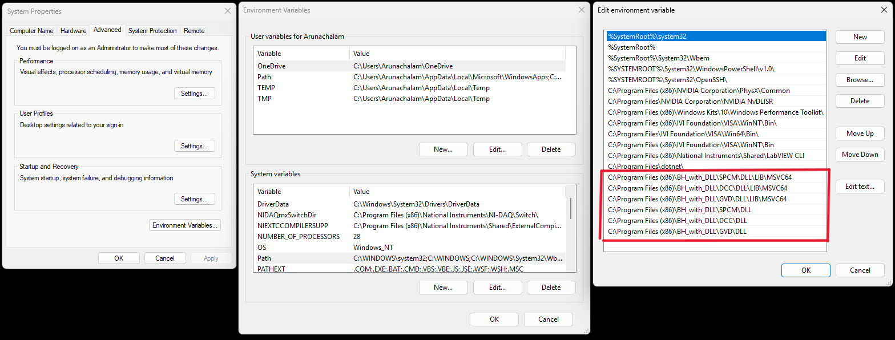

# how to use bh control programs

## compile the program

1. Make sure to add the directories containing library files to the system path:

Restart system for changes to take effect.

1. Build using CMake in Visual Studio: open project folder and run `Ctrl+Shift+B`


## pointwise/linewise FIFO measurements

1. Collect an image with SPCM

1. Process to generate targets for scanner

1. Run bh control program as follows.

For pointwise measurements:
```
C:\Users\TCSPC\Documents\GitHub\2pscopecontrol\bh\FCS_engine\pointwise_FIFO\out\build\x64-debug\FCS_engine.exe <path to working directory> <module index> <collection time in seconds>
```
Note that module index is 0/1 for M1/M2 resp. e.g.
```
C:\Users\TCSPC\Documents\GitHub\2pscopecontrol\bh\FCS_engine\pointwise_FIFO\out\build\x64-debug\FCS_engine.exe . 0 0.6
```

For linewise measurements:
```
C:\Users\Arunachalam\Documents\GitHub\2pscopecontrol\bh\FCS_engine\linescan_FIFO\out\build\x64-debug\FCS_engine.exe . 0 1.0 4
```